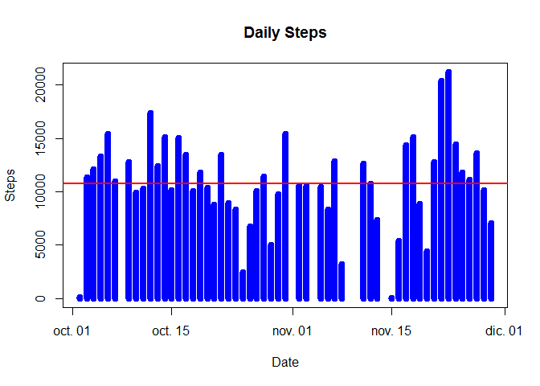

# Reproducible research assesment 1
Asier  

##Loading and preprocessing the data

We begin by unziping and loading the data. Furthermore, we convert the "date"" column to the corresponding date class. 


```r
data<-read.csv(unzip("activity.zip"))

data$date <- as.Date(data$date)
```

##What is mean total number of steps taken per day?

1. Calculate the total number of steps taken per day

We generate a data frame with the sum of steps for each day.


```r
library(reshape2)

meltdata <- melt(data, id.vars="date", measure.vars="steps", na.rm=T)

d1 <- dcast(meltdata, date ~ variable, sum)
```
2. Make a histogram of the total number of steps taken each day

We generate an histogram of the total number of steps using the previos data frame, we add the mean value to it for clarity.


```r
plot(d1$date, d1$steps, type="h", main="Daily Steps", xlab="Date", ylab="Steps", col="blue", lwd=8)
abline(h=mean(d1$steps, na.rm=TRUE), col="red", lwd=2)
```

 

3. Calculate and report the mean and median of the total number of steps taken per day


```r
paste("Mean Steps per Day =", round(mean(d1$steps, na.rm=TRUE),digits=3))
```

```
## [1] "Mean Steps per Day = 10766.189"
```

```r
paste("Median Steps per Day =", median(d1$steps, na.rm=TRUE))
```

```
## [1] "Median Steps per Day = 10765"
```


##What is the average daily activity pattern?

1.Make a time series plot

We begin by making a data frame similar to the previous one but in this case we calculate the mean steps per interval. 


```r
actmelt <- melt(data, id.vars="interval", measure.vars="steps", na.rm=TRUE)

d2 <- dcast(actmelt, interval ~ variable, mean)
```

We plot the results an add the mean value. 


```r
library(ggplot2)

plot(d2$interval, d2$steps, type="l", main="Average daily activity pattern", xlab="Interval", ylab="Steps", col="blue", lwd=3)
abline(h=mean(d2$steps, na.rm=TRUE), col="red", lwd=2)
```

 

2. Which 5-minute interval, on average across all the days in the dataset, contains the maximum number of steps?


```r
paste("Interval with max value =", d2$interval[which(d2$steps == max(d2$steps))])
```

```
## [1] "Interval with max value = 835"
```

```r
paste("Maximum interval mean steps =", round(max(d2$steps),digits=3))
```

```
## [1] "Maximum interval mean steps = 206.17"
```

##Imputing missing values

1.Calculate and report the total number of missing values in the dataset (i.e. the total number of rows with NAs)


```r
sum(is.na(data$steps))
```

```
## [1] 2304
```

2.Devise a strategy for filling in all of the missing values in the dataset. The strategy does not need to be sophisticated. For example, you could use the mean/median for that day, or the mean for that 5-minute interval, etc.

The strategy for filling the missing values consists on subtituting the 2304 missing values by the mean values for the particular interval. For that purpouse I will merge the original data with the previous data frame. Next, I will compare the number of steps per day to see how the data changes.

3.Create a new dataset that is equal to the original dataset but with the missing data filled in.


```r
datan<-data

#Merge the two data sets

mergedata <- merge(datan, d2, by="interval", suffixes=c(".act", ".mean"))

naind = which(is.na(datan$steps))

# Replace NA values with value from steps.mean

datan[naind,"steps"]<- mergedata[naind,"steps.mean"]
```

4. Make a histogram of the total number of steps taken each day and Calculate and report the mean and median total number of steps taken per day. Do these values differ from the estimates from the first part of the assignment? What is the impact of imputing missing data on the estimates of the total daily number of steps?

We will generate a data frame with the new data set containing the sum of steps for each day.  


```r
meltdatan <- melt(datan, id.vars="date", measure.vars="steps", na.rm=FALSE)

dn <- dcast(meltdatan, date ~ variable, sum)
```


We now plot the histogram with the new data


```r
plot(dn$date, dn$steps, type="h", main="Daily Steps", xlab="Date", ylab="Steps", col="blue", lwd=8)
abline(h=mean(dn$steps, na.rm=TRUE), col="red", lwd=2)
```

 

We calculate the mean and median for the new data set and the difference with the old one.


```r
paste("Mean Steps per Day =", round(mean(dn$steps, na.rm=TRUE),digits=3))
```

```
## [1] "Mean Steps per Day = 10889.799"
```

```r
paste("Median Steps per Day =", median(dn$steps, na.rm=TRUE))
```

```
## [1] "Median Steps per Day = 11015"
```


```r
paste("Difference in mean Steps per Day(New-Old) =",round(mean(dn$steps, na.rm=TRUE)-mean(d1$steps, na.rm=TRUE),digits=3))
```

```
## [1] "Difference in mean Steps per Day(New-Old) = 123.611"
```


```r
paste("Difference in median Steps per Day(New-Old) =", median(dn$steps, na.rm=TRUE)-median(d1$steps, na.rm=TRUE))
```

```
## [1] "Difference in median Steps per Day(New-Old) = 250"
```


```r
paste("Difference in max Steps per Day (New-Old) =", round(max(dn$steps,na.rm=TRUE)-max(d1$steps, na.rm=TRUE),3))
```

```
## [1] "Difference in max Steps per Day (New-Old) = 2955.717"
```

##Are there differences in activity patterns between weekdays and weekends?

1.Create a new factor variable in the dataset with two levels - "weekday" and "weekend" indicating whether a given date is a weekday or weekend day.


```r
#Change the locale language (if neccesary)
Sys.setlocale("LC_TIME", "English")
```

```
## [1] "English_United States.1252"
```

```r
#Create a vector that fills the new column "dayof" will all weedays.

datan$dayof<-rep("weekday",nrow(datan))

#Subtitude the required ones with weekends.

for(i in 1:nrow(datan)){
        if(weekdays(datan$date[i])=="Saturday"|weekdays(datan$date[i])=="Sunday"){
                
                datan$dayof[i]<-"weekend"
                     
        }
} 
```

Next we subset the data to create two different data frames depending on the category. We continue by calculating the mean.


```r
#subset the data
dataday <- subset(datan, dayof=="weekday")
dataend <- subset(datan, dayof=="weekend")

# Next, we need to process the data for our needs
meltday <- melt(dataday, id.vars="interval", measure.vars="steps")
meltend <- melt(dataend, id.vars="interval", measure.vars="steps")
dday <- dcast(meltday, interval ~ variable, mean)
dend <- dcast(meltend, interval ~ variable, mean)
```
2.Make a panel plot containing a time series plot

Finally we proceed to plot the figures correspondint to weekdays and weekends. 


```r
# Load plot packages necessary to continue
library(ggplot2)
library(gridExtra)
```

```
## Loading required package: grid
```

```r
plot1 <- qplot(interval, steps, geom="line", data=dday, type="bar", main="Steps by Interval in Weekday", xlab="Interval", ylab="Steps")
plot2 <- qplot(interval, steps, geom="line", data=dend, type="bar", main="Steps by Interval in Weekend", xlab="Interval", ylab="Steps")
grid.arrange(plot1, plot2, nrow=2)
```

 
